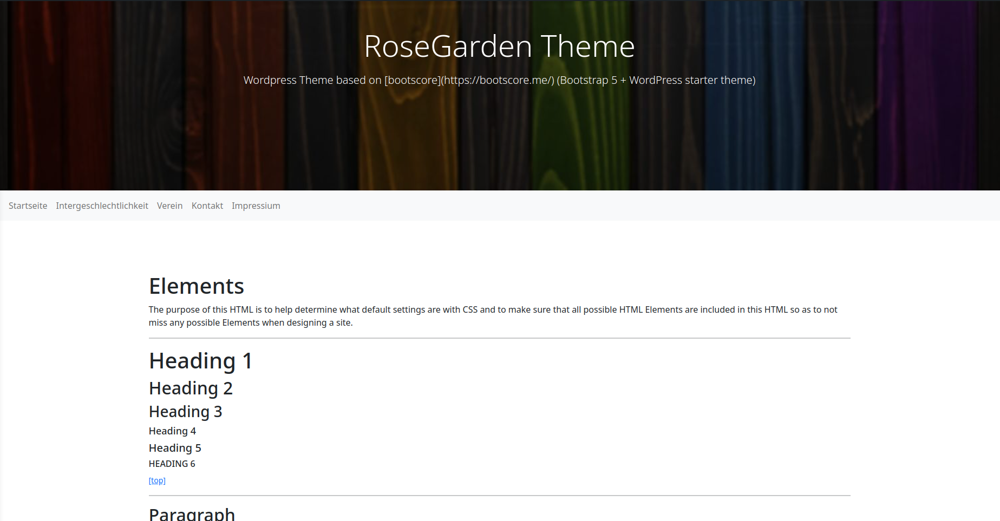

## RoseGarden
### Wordpress Theme based on [rosegarden](https://rosegarden.me/) (Bootstrap 5 + WordPress starter theme)

RoseGarden combines the Underscores theme boiler template with Bootstrap 5 in a small starter theme for great WordPress projects. There are no settings in the customizer, no logo-uploader and no drag'n'drop. RoseGarden is 100% customizable by using the .php, .scss and .js files. Basic coding skills for editing are required.

## Screenshot

## Installation

1. Download latest release [rosegarden-main.zip](https://github.com/eotpcomic/rosegarden/releases).
2. Upload theme via the WordPress theme-uploader and activate it.

## License & Credits

- rosegarden, MIT License https://github.com/rosegarden/rosegarden/blob/main/LICENSE
- Bootstrap, MIT License https://github.com/twbs/bootstrap/blob/main/LICENSE
- Bootstrap 5 WordPress Navbar Walker by AlexWebLab, MIT License https://github.com/AlexWebLab/bootstrap-5-wordpress-navbar-walker/blob/main/LICENSE
- Font Awesome Free License https://fontawesome.com/license/free
- scssphp by Leaf Corcoran, MIT License https://github.com/scssphp/scssphp/blob/master/LICENSE.md
- Plugin Update Checker by YahnisElsts, MIT License https://github.com/YahnisElsts/plugin-update-checker/blob/master/license.txt

